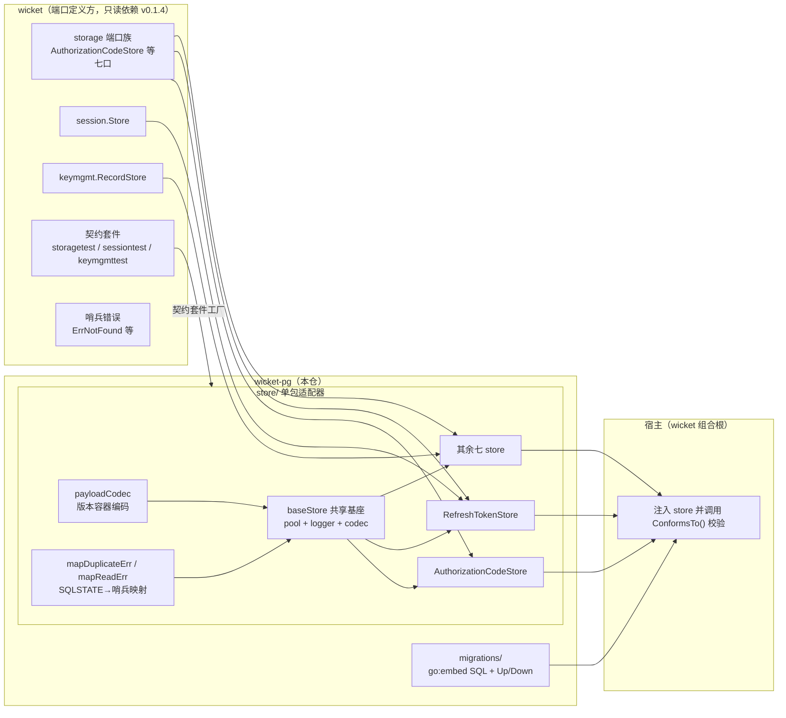
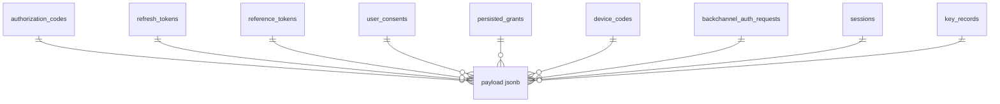
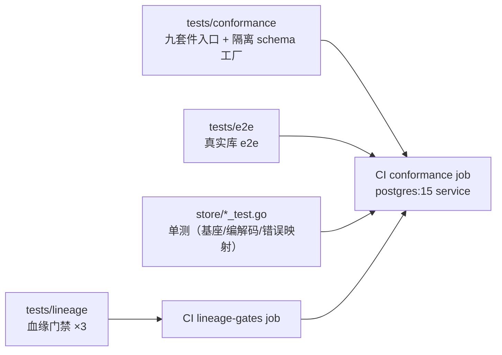

# wicket-pg 架构文档

> 面向读者的任务：理解本仓如何用 PostgreSQL 实现 wicket 的存储端口，改动时知道往哪个文件改、遵循什么不变量。设计期完整论述见 `_bmad-output/planning-artifacts/architecture/architecture-wicket-pg-2026-08-07/ARCHITECTURE-SPINE.md`。

## 一、架构模式：端口与适配器（六边形）



**依赖方向**：宿主 → 本仓适配器 → wicket 端口接口。本仓是平级适配器仓：`require` wicket 已发布版本，不复制其内部实现；wicket 不实施本仓任何代码。

## 二、技术栈与关键决策

| 决策 | 选择 | 理由（要点） |
|---|---|---|
| 驱动 | `pgx/v5` 原生接口（`pgxpool.Pool`） | 不经 `database/sql` 抽象层（spec 决策） |
| 序列化 | 版本容器单列 `payload jsonb`（`{"version":1,"dataProtected":false,"payload":"<base64>"}`） | model 演进时 schema 不必跟着动；`store/codec.go` |
| 真实列 | 只落查询路径与守卫所需最小集 | 句柄主键、subject/client/type 过滤列、生命周期列、版本守卫列、keymgmt 唯一性列；其余进 payload |
| 迁移 | go:embed SQL + 自研幂等记账 `schema_migrations` | 不引入外部迁移库、不依赖宿主装 CLI；文件名沿 golang-migrate 惯例便于未来换工具 |
| 过期判定 | **禁止** SQL 内 `expires_at > now()` | 适配器用数据库时钟、核心用注入 Clock，集群时钟漂移下结论分裂；清理入口只回收空间 |
| 清理形态 | 显式入口 `RemoveExpired(ctx, cutoff time.Time) (int, error)` | 调用方驱动的一次性回收、返回计数；不起后台 goroutine |

## 三、store 包结构

`store/` 是单包适配器：九个公开 store 类型 + 未导出共享基座。

### 共享基座（`store/base.go`）

```go
type baseStore struct {
    pool   *pgxpool.Pool  // 宿主所有，构造器不创建不关闭
    logger *slog.Logger   // nil 回退 slog.Default()
    codec  *payloadCodec  // 无状态 JSON 版本容器编解码
}
```

**构造器形态**（九个 store 完全一致）：

```go
func NewXxxStore(pool *pgxpool.Pool, logger *slog.Logger) *XxxStore
```

构造器只组装基座；连接池生命周期属于宿主，所有 store 均未实现 `io.Closer`。

### 错误映射（`store/errors.go`）

统一两条规则，基座下所有 store 共用：

| 底层错误 | 映射结果 |
|---|---|
| SQLSTATE 23505（唯一约束冲突） | 端口族重复哨兵（`storage.ErrDuplicateHandle` / `keymgmt.ErrDuplicateKey`） |
| `pgx.ErrNoRows` | 端口族缺失哨兵（`storage.ErrNotFound`） |
| 其它基础设施错误 | `fmt.Errorf("%w", err)` 包装，`errors.Is` 可判定 |

**禁止返回 `(nil, nil)`**：单记录读不存在返哨兵错误，基础设施故障返包装错误。列表方法返回空非 nil slice（`[]*Xxx{}`），不返哨兵。

### 版本容器（`store/codec.go`）

```json
{"version":1,"dataProtected":false,"payload":"<base64(JSON model)>"}
```

`[]byte` model 字段会被 base64 双重编码（encoding/json 一次 + 本层一次），往返无损。适配器只写 version 1。

## 四、数据架构

10 张表（`schema_migrations` + 9 张业务表）、15 个显式索引。**每张表、每个索引都能指名对应的端口方法**——这是硬性维护约定（AC-2），完整对应表见 [schema-design-record.md](./schema-design-record.md)，总览见 [data-models.md](./data-models.md)。



要点：
- **单点取用**：`handle` / `session_id` / `key` 单列主键。
- **批量吊销**：`persisted_grants` 落 `subject_id`/`session_id`/`client_id`/`type` 四过滤真实列；`sessions.subject_id`（迁移 000003）、`device_codes.user_code`（迁移 000002）为后补维度列。
- **清理**：`expires_at` 列（session 特例叫 `expires`）+ 对应索引；NULL 表示永不过期。
- **版本守卫**：仅 `refresh_tokens` 与 `key_records` 有 `version bigint` 列（AD-3）。
- **唯一性**：`key_records` 部分唯一索引（`phase <> 'retired'`）；`device_codes.user_code` 唯一索引双职责（读路径 + 重复拒绝）。

## 五、migrations 包

- `//go:embed *.sql` 嵌入全部迁移，`Up(ctx, pool)` 按版本顺序逐文件在**单连接**上执行（保持 search_path），每文件一个事务，记账 `schema_migrations(version, applied_at)`；重复调用幂等。
- `Down(ctx, pool)` 逆序回滚；未迁移过的库是 no-op。
- DDL 不写 schema 名，全部相对连接当前 search_path——宿主与测试工厂可钉专属 schema（e2e 已验证 `public` 无泄漏）。

## 六、验证架构（三组测试，见 development-guide.md）



- **血缘门禁**：原创作权（文件头）、零上游血缘标注、中性提交信息——先跑并 gate 住一切构建。
- **契约套件**：九个入口分别调用 wicket 三套件；工厂每次调用创建全新空 store（隔离 schema + 专属 pool），并行子测试互不污染；MUST 全绿，MAY 级逐条留档。
- **合规凭证**：每个 store 暴露 `ConformsTo() string`，返回所属套件的 `SuiteVersion`（grant 族与 session/keymgmt 各自独立）。

## 七、关键不变量（改动红线）

1. 首参 `context.Context`；不在适配器内自造 `context.Background()`/`TODO()`，不自设超时。
2. 日志走注入 `*slog.Logger`；**凭据物料（令牌、句柄、密钥、secret）禁止落任何级别日志**，只记存在性与标识符前缀。
3. 默认 insert-only；句柄碰撞返 `ErrDuplicateHandle`；`expectedVersion` 冲突返 `ErrVersionConflict`。
4. 迁移与清理**不起后台 goroutine**。
5. SQL 永不出现时钟函数；`RemoveExpired` 统一形态 `DELETE ... WHERE <列> IS NOT NULL AND <列> < $cutoff`。
6. 文件首行 `// Copyright 2026 Decker.`；任何文件不得出现血缘标注（门禁转红）。
7. 九个 store 均暴露单值签名 `ConformsTo() string`。

## 八、依赖与演进

- 依赖树全部是已发布版本（wicket v0.1.4、pgx v5.10.0、yaml.v3 测试用），无 go.work 搭桥。
- 已识别风险（deferred-work 留档）：并发 `Up` 无 advisory lock（多实例并发启动 PK 冲突）；`schema_migrations` 表名与 golang-migrate 默认表同名冲突。`go 1.27rc1` directive 对 dependabot/gopls 的生态摩擦已消除（Go 1.27.0 发布后两处去 rc，2026-08-21）。
