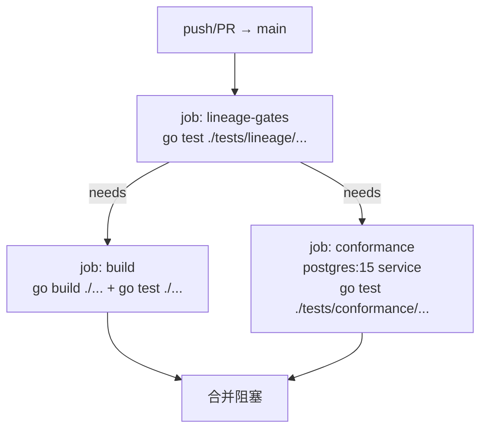

# wicket-pg 部署与 CI 指南

> 面向读者的任务：理解 CI 门禁顺序、如何发布新版本、合并/发布时注意什么。

## 一、CI 管线（`.github/workflows/ci.yml`）



| Job | 做什么 | 环境 |
|---|---|---|
| `lineage-gates` | 三项血缘门禁（版权头 / 零上游标注 / 中性提交信息） | Go `1.27.0-rc.1` |
| `build` | `go build ./...` + `go test ./...`（无库测试自动 skip） | Go `1.27.0-rc.1`，`needs: lineage-gates` |
| `conformance` | 三组契约套件（grant 族 7 口 + session + keymgmt）对真实 PG 跑，30 分钟超时 | `postgres:15` service 容器，`WICKET_PG_TEST_DATABASE_URL` 注入 |

设计要点：

- **血缘门禁先跑并 gate 住一切**：授权问题应在任何构建工作之前失败（`build` 与 `conformance` 都 `needs: lineage-gates`）。
- **契约套件用 service 容器**（`postgres:15`），不用 testcontainers。
- **CI 配置被静态断言**：`tests/e2e/ci_job_e2e_test.go` 用 yaml 解析 workflow 文件，校验 service 形态、环境变量注入、命令形态（`GOWORK=off`、无 `WithMay` 强制）等——**改 `ci.yml` 必须同步更新该测试**。
- **安全红线**：CI 不消费事件提供的文本，`run:` 块全是固定命令，禁止把 `${{ github.event.* }}` 插进 `run:` 块（命令注入路径）。

## 二、本地等价验证（CI 实跑前提）

合并前保证三件事全绿：

```bash
GOWORK=off go test ./tests/lineage/...        # = lineage-gates job
GOWORK=off go build ./... && GOWORK=off go test ./...   # = build job（无库环境）
WICKET_PG_TEST_DATABASE_URL=... GOWORK=off go test ./tests/conformance/...  # = conformance job
```

无法本地跑契约套件时：push 后到 Actions 页确认三个 job 均绿再合并（sprint-status 中 epic-2 有对应 action item）。

## 三、发布流程

1. **功能与测试就绪**：全量回归绿（见上）；`git status` 干净；story 交付物齐全。
2. **版本号同步**：打 tag 前确认 `README.md` 引用版本、`go.mod` 依赖（wicket 侧）与实际一致。
3. **打 tag**（轻量 tag）：

```bash
git tag v0.1.1
git push origin v0.1.1
```

4. **发版纪律**：
   - tag 携带 rc 的 Go directive 之前，版本标记需与工具链状态同步（首个 tag 不得携带 rc directive 的红线：Go 1.27 正式版发布后，`go.mod` 的 `go 1.27rc1` 与 `ci.yml` 的 `1.27.0-rc.1` **两处同步去 rc**）。
   - 已发布 tag 不可变：v0.1.0 因分发层分裂（proxy/sumdb 固定去 rc 旧内容，与 GitHub tag 分裂）**不可用**，默认 GOPROXY 消费者拉到的 v0.1.0 不可编译——文档只引用 v0.1.1。
   - 提交信息保持功能中性（门禁扫全量 git 历史）。

## 四、远端操作注意事项

- `gh` 命令必须排除代理（环境有全局代理，直连会失败）：

```bash
NO_PROXY="*" HTTP_PROXY="" HTTPS_PROXY="" gh <command>
```

- 历史遗留：在 v0.1.0 tag 窗口期 fetch 过的 clone 会永久残留陈旧 tag 引用（git fetch 拒绝移动已有轻量 tag），无法从本仓修复，仅需知晓。

## 五、部署形态（给宿主）

本仓是库不是服务，无 Dockerfile / K8s 清单——「部署」即宿主集成：

1. 宿主 `go get github.com/gonewx/wicket-pg@v0.1.1`；
2. 启动序列中调用 `migrations.Up(ctx, pool)`（幂等）；
3. 构造九个 store 注入 wicket，装配期调用各 store 的 `ConformsTo()` 比对套件版本。

宿主注意（已知风险，deferred-work 留档）：

- **连接池生命周期**：本仓 store 不创建也不关闭 pool，也不实现 `io.Closer`——宿主必须自己 `pool.Close()`。
- **多实例并发迁移**：并发 `Up` 无 advisory lock，多实例同时启动可能 PK 冲突；建议单实例迁移或自行加锁。
- **表名冲突**：`schema_migrations` 与 golang-migrate 默认表同名；共用库宿主注意。
- **清理入口**：宿主自行按需调用各 store 的 `RemoveExpired(ctx, cutoff)`（显式一次性回收，返回计数），适配器不起后台任务。
